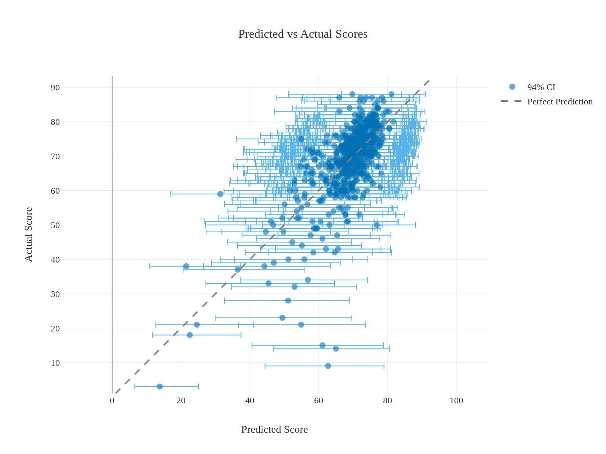
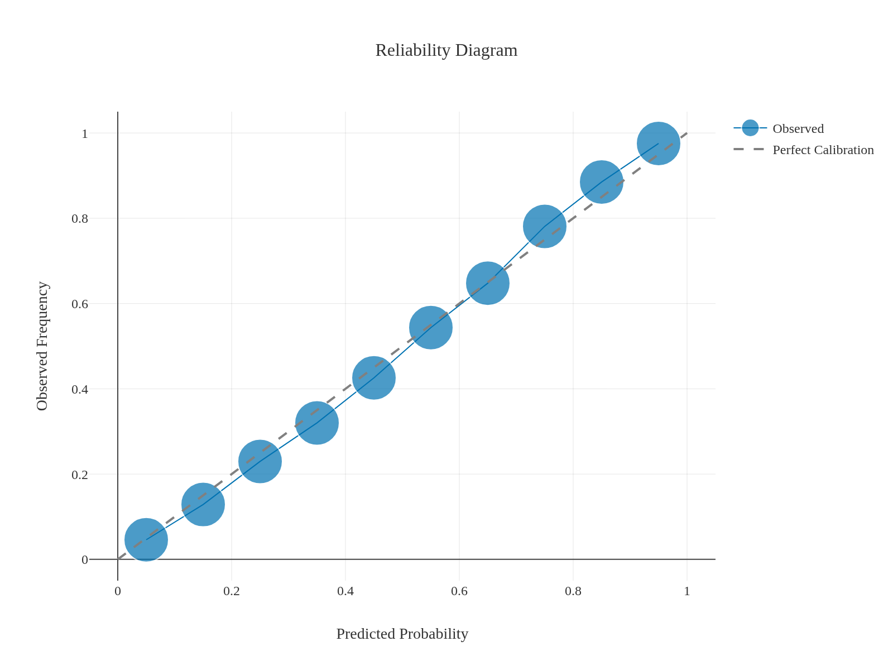
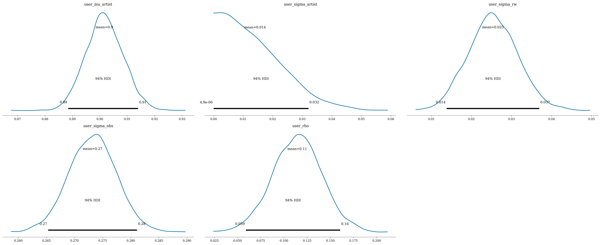
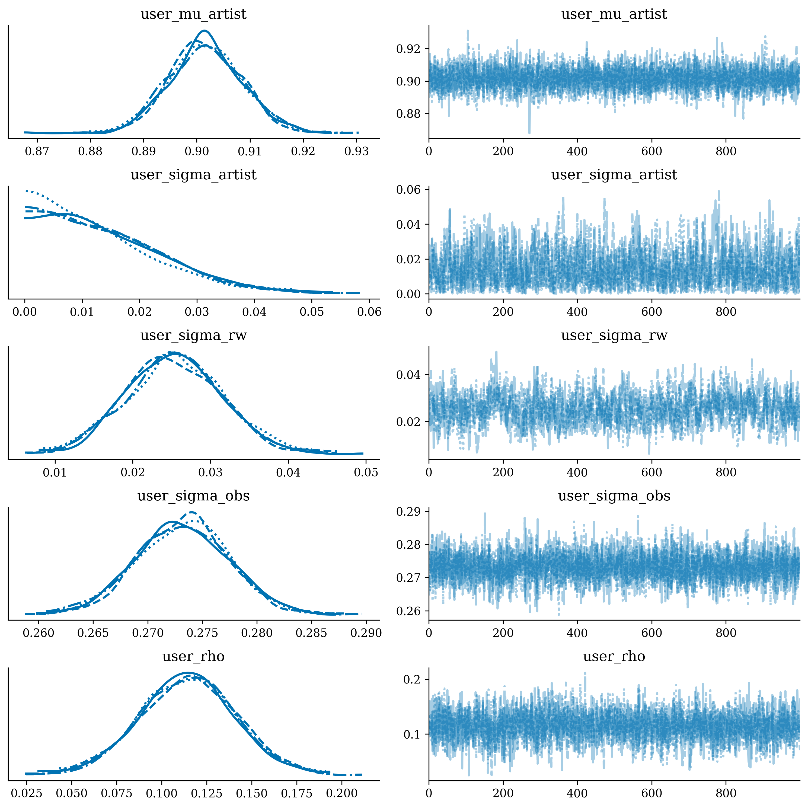
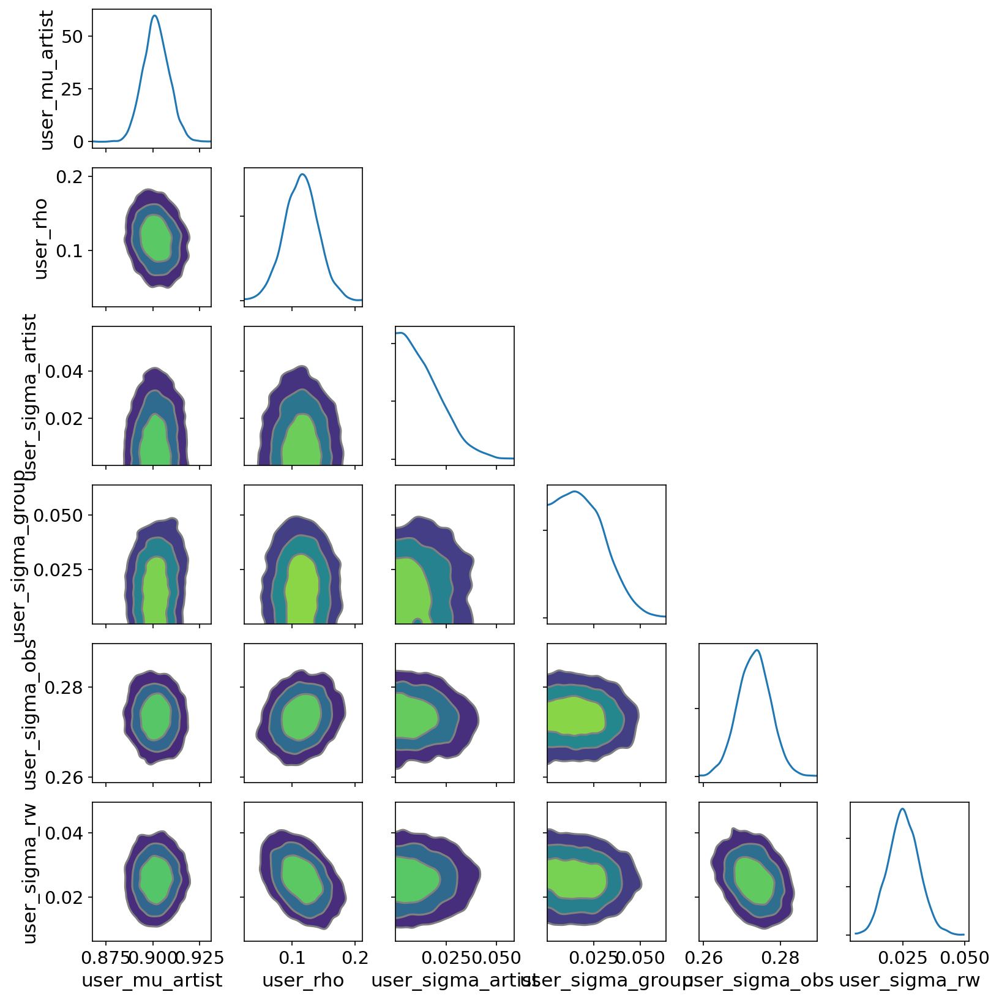

# panelcast

[](https://github.com/cupidthatbtc/panelcast/actions/workflows/ci.yml)
[](https://github.com/cupidthatbtc/panelcast/actions/workflows/nightly.yml)
[](https://codecov.io/gh/cupidthatbtc/panelcast)

[](LICENSE)
[](https://pixi.sh)


> **⚠️ Experimental — real-data validated on a subset; full corpus pending.**
>
> The reproducibility, diagnostics, and domain-portability scaffolding is the
> finished part. The headline *statistical* result is now **partially
> established on real data**: on a representative ~800-artist / ~5,182-album
> AOTY subset (skewness −2.08), the published fit **passes the convergence
> gate** at the amended publication configuration with the 0.13.0 entity-obs
> default (R-hat 1.00, bulk ESS 1,119, 0 divergences), and the baseline
> benchmark runs on the same real splits. Still open: the **skewness and max**
> posterior-predictive p-values stay pinned by a bounded-skew mismatch — six
> likelihood families plus a dequantization toggle were tried with **none
> resolving them**, though the entity-obs default cleared q10 and q90, the
> first movement on those tails — and this is the validated subset, not the
> full eligible corpus (~62k albums with ≥10 ratings; #15). See
> [`MODEL_CARD.md`](MODEL_CARD.md) and
> [`docs/LIKELIHOOD_CANDIDATES.md`](docs/LIKELIHOOD_CANDIDATES.md). Treat the
> subset numbers as real but not final. Canonical numbers:
> [`.audit/release_results.json`](.audit/release_results.json).

**Hierarchical Bayesian prediction for bounded scores of events nested in entities over time — configured by one YAML descriptor.**

Lots of forecasting problems share a shape: *entities* accumulate a history of
*events*, each event carries a *bounded score* and a noisy *observation count*,
and you want to predict the next score. Musicians release albums rated 0–100.
Airframes fly test flights scored 0–10. Candidates contest elections with a
vote share in [0, 1]. panelcast models that shape once — partial pooling across
entities, a time-varying entity effect, album-to-album (event-to-event)
dependence, and review-count-scaled noise — and lets you point it at a new
domain with a single descriptor file and **zero source changes**.

The emphasis is the infrastructure *around* the model as much as the model
itself: leakage controls, data lineage, preflight gates, and
convergence/calibration diagnostics as first-class, gating checks.

## Domains

Every dataset-specific name (columns, target bounds, date formats, posterior
prefixes, feature blocks) flows through a single `DatasetDescriptor`. Each field
**defaults to its AOTY value**, so a new domain only states what differs.

| Domain | Entity → Event | Bounded score | Status |
|---|---|---|---|
| **Album of the Year** (flagship) | Artist → Album | `User_Score` ∈ [0, 100] | Built-in defaults + the `aoty` feature pack (genre, album-type, collaboration). Run with no `--dataset` flag. |
| **Aerospace** (worked example) | Airframe → Test flight | `Perf_Score` ∈ [0, 10] | Bundled descriptor `configs/datasets/aero.yaml` + end-to-end portability test. One YAML, no music-specific code. |
| **US elections** | Candidate/seat → Contest | Vote share ∈ [0, 1] | Sibling project (`elections_pred`) that retargets this pipeline — lives in its own repo, not bundled here. |

The contract that `--dataset aoty_full` is byte-identical to running with no flag
at all is enforced by `tests/e2e/test_domain_portability.py`. See
[`docs/PORTING.md`](docs/PORTING.md) for the full walkthrough.

**Replications.** [panelcast-replications](https://github.com/cupidthatbtc/panelcast-replications)
re-analyses published panel studies through this pipeline — one descriptor YAML
per paper, zero source changes: Berry–Reese–Larkey 1999 (baseball aging/ability)
and Strittmatter–Sunde–Zegners 2020 (chess cognitive life cycle), with the
diagnostic ladder and identification caveats written up in full.

## Model structure

Hierarchical partial pooling across entities; a time-varying entity effect via a
Gaussian random walk; AR(1) event-to-event dependence; heteroscedastic
observation noise scaled by observation count; non-centered parameterization
(`LocScaleReparam`) plus a sigma-ref reparameterization to break the
multiplicative funnel; Student-t likelihood with a soft-clip to the target
bounds. The default Student-t is one of nine selectable observation families
(`--likelihood-family`: also `normal`, `skew_studentt`, `skew_normal`,
`split_normal`, `beta`, `mixture`, `beta_binomial`, `beta_ceiling`), with an optional
integer-aware dequantization toggle. Optional per-entity overdispersion with a
lognormal variance prior is available behind a gate. Built on
[NumPyro](https://num.pyro.ai/) / JAX.

## How it compares — and what it's for

On the ~5,000-album AOTY subset, against baselines fit on the same real splits
(within-entity temporal holdout, N = 653):

| | MAE | R² | 80% cov | 95% cov |
|---|---:|---:|---:|---:|
| **panelcast** | **5.28** | **0.498** | 0.830 | 0.968 |
| ridge | 5.38 | 0.498 | 0.879 | 0.965 |
| gradient boosting | 5.58 | 0.471 | 0.763 | 0.888 |
| entity mean | 6.11 | 0.322 | 0.818 | 0.925 |

The model **leads on MAE** and ties ridge on R² (0.498 each), while carrying the
only *modeled* intervals, near-nominal at 0.83/0.97. The MAE margin over ridge is
modest (5.28 vs 5.38); the decisive gaps are CRPS and calibration — the
gradient-boosted regressor lands close on raw error but **under-covers** badly
(0.76/0.89), its intervals a bolt-on rather than a modeled quantity. On the cold-start
(never-seen entity) split it leads outright (MAE 6.82, R² 0.117, 95% coverage 0.965).
Point accuracy was never the deliverable, though — *calibrated uncertainty* is:
intervals as a modeled quantity, an interpretable between-entity vs residual variance
decomposition, and a generative model you can interrogate — and the model now wins on
accuracy too. Full table, cold-start behaviour, and the R²-by-history gradient:
[`docs/BASELINES.md`](docs/BASELINES.md).

## Example output

The flagship AOTY model, fit on a ~5,000-album subset (within-artist temporal
holdout). The pipeline's `report` stage renders these automatically.

Predicted vs. actual on held-out next albums (95% interval), and interval
calibration (predicted vs. empirical coverage, ~650 albums/bin):

 

What the model learned — posterior densities of the headline parameters (94% HDI):
the average album sits near 71/100, and album-to-album dependence (`rho`) is weak
once the artist level is centered out:



Convergence and posterior geometry — per-chain traces and densities for the
headline parameters (4 chains, well-mixed), and their pairwise joint posterior
(round contours, no funnels — the non-centered parameterization doing its job):

 

## Install

**Prerequisite:** Python ≥ 3.11.

```bash
pip install panelcast
panelcast --help
```

For the exact tested environment or repository development, use
[pixi](https://pixi.sh):

```bash
git clone https://github.com/cupidthatbtc/panelcast.git
cd panelcast
pixi install
pixi run panelcast --help
```

> `pixi.lock` is the reproducible environment: it pins the full stack, notably
> the tightly coupled JAX/NumPyro pair. A plain pip installation obeys the tested
> dependency bounds but does not promise an identical solver result. Use pixi
> for publication or reproduction work.

## 60-second quickstart (aerospace example)

Retarget the whole pipeline to a non-music domain with no code changes, using
the bundled synthetic aerospace dataset (committed under `examples/aerospace/`:
8 airframes flying ~39 sequential test flights scored 0–10):

```bash
# Run the entire pipeline end-to-end on the example, at tiny scale
panelcast demo
```

`demo` reads the bundled aerospace descriptor and CSV from the installed wheel
(the checkout copies live under `examples/aerospace/`). The descriptor remaps the
columns, switches the score bounds to [0, 10], drops the music-specific feature
packs, and adds the domain's own numeric covariates. It runs data → splits →
features → train → evaluate → predict → report, finishing with a generated
model card under `outputs/<run_id>/reports/`. The model code is untouched.

The committed CSV is regenerated from the shared synthetic generator with
`python scripts/generate_aero_example.py`. To benchmark the model against simple
baselines on the splits it just produced:

```bash
panelcast compare --baselines --dataset aero
```

To run the flagship AOTY domain instead, point at your data and omit `--dataset`:

```bash
export AOTY_DATASET_PATH="/path/to/aoty_data.csv"
panelcast run --preflight-only      # GPU-memory / schema / calibration gate
panelcast run                       # full pipeline
panelcast stage train --verbose     # or run a single stage
```

See [`docs/CLI.md`](docs/CLI.md) for the complete command reference.

## Features

- Leak-safe data pipeline and evaluation (within-entity temporal split + an
  entity-disjoint secondary check)
- Explicit data contract and lineage from raw CSV to final artifacts
- Preflight gates (GPU memory, schema validation, calibration) before expensive runs
- Convergence + PPC + coverage diagnostics as first-class, gating checks
- Sensitivity matrix over priors, splits, and feature ablations
- Publication-ready artifacts: tables, figures, model card, citations
- Domain portability proven by an end-to-end test, not just asserted — the
  *apparatus* (descriptor → pipeline) runs on a new domain with zero source
  changes; predictive accuracy off the flagship domain is untested by construction

## Documentation

- [`docs/GETTING_STARTED.md`](docs/GETTING_STARTED.md) — step-by-step startup guide (start here)
- [`docs/PORTING.md`](docs/PORTING.md) — retarget to a new domain (the aerospace walkthrough)
- [`docs/EXTENSIBILITY.md`](docs/EXTENSIBILITY.md) — adding features safely
- [`docs/CLI.md`](docs/CLI.md) — complete CLI reference
- [`docs/API.md`](docs/API.md) — supported Python import surface and its semver guarantee
- [`docs/LEAKAGE_CONTROLS.md`](docs/LEAKAGE_CONTROLS.md) — guardrails and leakage prevention
- [`docs/EVALUATION_PROTOCOL.md`](docs/EVALUATION_PROTOCOL.md) — metrics, diagnostics, and thresholds
- [`docs/PROJECT_STRUCTURE.md`](docs/PROJECT_STRUCTURE.md) — directory and file layout
- [`docs/DATA_CONTRACT.md`](docs/DATA_CONTRACT.md) — raw schema and cleaned artifacts
- [`docs/LINEAGE.md`](docs/LINEAGE.md) — repository lineage (the private predecessor, the 2026-06-20 migration) and JOSS submission timing
- [`MODEL_CARD.md`](MODEL_CARD.md) — intended use, results, and limitations

A note on results: at the amended publication configuration the published fit
**passes the convergence gate** on a real ~800-artist / ~5,182-album AOTY
subset (R-hat 1.00, bulk ESS 1,119, 0 divergences) under the default
**Student-t** likelihood on the `offset_logit` transformed scale with the
0.13.0 entity-obs default:

```bash
panelcast run --preset publication        # 4 chains × 5000, Student-t likelihood
panelcast diagnose                        # convergence + PPC of that run
panelcast compare --baselines             # the model vs. simple baselines
```

What's resolved: leak-safe splits with role-based names, an honest baseline
comparison (`panelcast compare`) on the same real splits, and a convergent
publication-scale fit on real data. Still open: the **skewness and max**
posterior-predictive p-values stay pinned at the extremes from a
symmetric-likelihood / left-skewed-target mismatch — six likelihood families
(`beta`, `skew_studentt`, `skew_normal`, `split_normal`, `beta_binomial`,
`mixture`) plus a dequantization toggle were tried and **none resolves them**,
though the entity-obs default cleared the q10 and q90 pins (see
[`docs/LIKELIHOOD_CANDIDATES.md`](docs/LIKELIHOOD_CANDIDATES.md)) — and this is
the validated subset, not the full eligible corpus (~62k albums with ≥10 user
ratings), which needs the full dataset and a GPU (#15). The code, the
diagnostics, and the honest naming of what is and isn't resolved are the point.
Every headline number here derives from the canonical release-result manifest,
[`.audit/release_results.json`](.audit/release_results.json), and drift fails CI.

## License

MIT License. See [LICENSE](LICENSE) for details.
